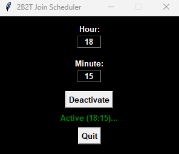

# About
This app launches Minecraft and then joins the 2B2T server at the specified time. It's open source, you can inspect the code and decide whether it's clean or not or even build it yourself.
- Screenshot:


# Requirements
**This settings are required to make the app work:**
- Launcher: Minecraft Launcher (The Minecraft Launcher window should be maximized and the game profile should be selected)
- Resolution: 1920x1080
- Video Settings > GUI Scale: 2
- Video Settings > Fullscreen: ON
Adjust these once and then exit Minecraft before **running the scheduler**.

> [!NOTE]
> The app is using static coordinates to automate clicking for now. So the Fullscreen and GUI Scale settings are must to have. Also the Minecraft Launcher window should be maximized and the game profile (version or maybe the cheat client e.g. "fabric-1.21.1") must be selected before running the app in order to make it work properly. I'm planning on making it work with text recognition so the app could work at any resolutions.

# Usage
- Download [2B2T-Scheduler.exe](https://github.com/cagritaskn/2b2t-join-scheduler/releases/download/release/2B2T-Scheduler.exe).
- Set the requirements in the **Requirements** title above for app to work properly.
- Open the [2B2T-Scheduler.exe](https://github.com/cagritaskn/2b2t-join-scheduler/releases/download/release/2B2T-Scheduler.exe) and specify the time then click on Activate.

# Running the app as a Python script
Download the [schedulerapp.py](https://github.com/cagritaskn/2b2t-join-scheduler/blob/main/schedulerapp.py) , open a command prompt in it's directory and run the command:
```
python schedulerapp.py
```

Or you can turn it into an exe by opening a command prompt in it's directory and running the command:

```
pyinstaller --onefile --windowed schedulerapp.py
```

# Contact
If you face any issues or errors you can contact me at:
Discord: "kegrisko." (The ID has a dot at the end)

# Dupe
This project works well with the cactus dupe. (Planning on adding the popbob bed dupe later.)

# License
This code is licensed under the GNU General Public License v3. **You can only use this code in open-source clients that you release under the same license! Using it in closed-source/proprietary clients is not allowed.**
